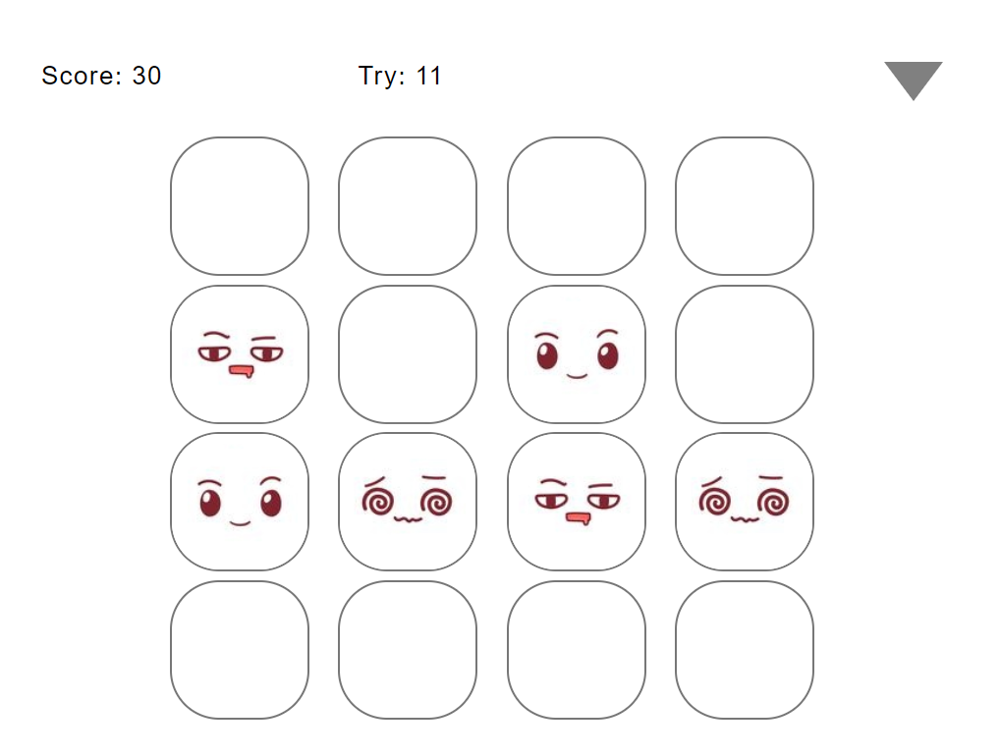
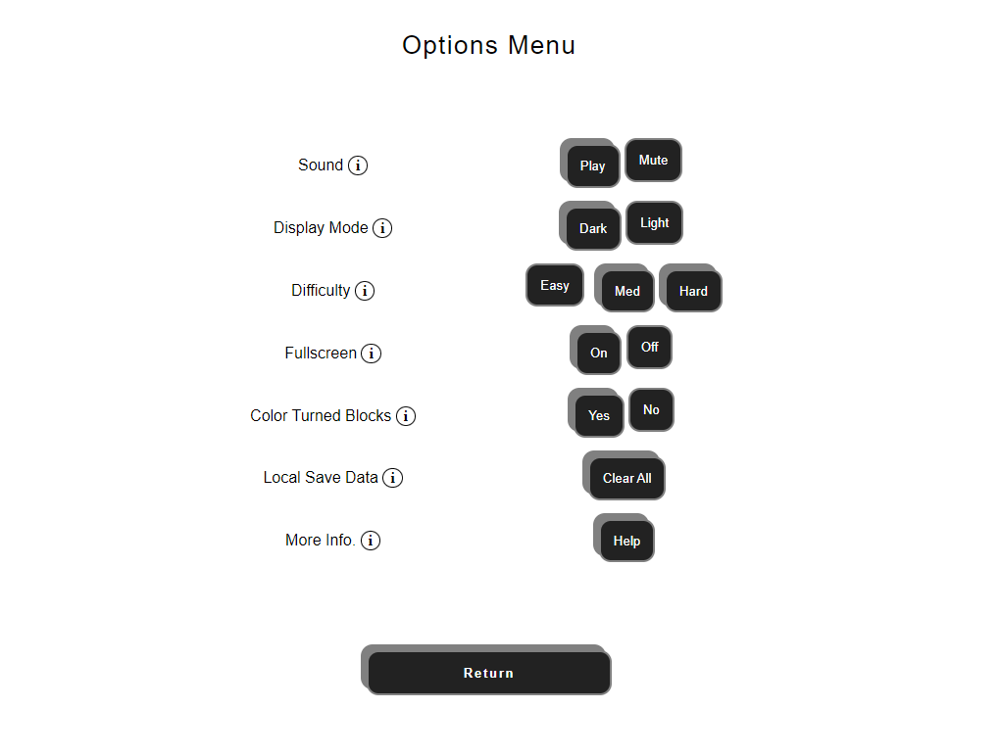

# New Game Name
A simple memory game made using only HTML, CSS and JavaScript. It has typical game features such as cloud save-game and high-score submits. This game runs in the browser, and does **not** require any download/installation. 

## About
This is a memory game. Just click on the blocks until you find the matching ones.  
Points are awarded for each pair found.  
Points are deducted for too many attempts, so tread carefully.  
The 'Options' menu has many preferences that affect scoring and gameplay.
That's it. Enjoy!

## ScreenShots

</img>
</img>
</img>

## Features
- Play offline.
- Play in dark-mode.
- Change game difficulty.
- Publish high-score to online scoreboard.
- Save game and continue on another device.
- Sound effects and background music.
- Player registration and log-in.
- Preferences saved to device.
- Tooltips and help option.
- Responsive - played on mobile or desktop.
- High contrast for improved accessibility.

## How To Play
All necessary files will be loaded into your browser. The game can be played offline, with local save-game to save progress, but cloud save-game and highscore submit features will not be available. The game can be played on desktop or mobile.
 
**[Play The Game Here](http://.../)**

## Bug(s)
- 'Color Turned Blocks' feature - blocks colored when feature is ON will not change back when feature is switched OFF before load/continue game. The feature setting will work correctly for all other blocks. This bug does not affect gameplay, only user-experience.

## Game Libraries Used
No Gaming/Physics Libraries/Frameworks were used. Coded using HTML5, CSS3, JS (ES6).

## Author
This game was created by **Rishaad**.
1) [Email](mr.rishaad@gmail.com)
2) [LinkedIn](https://www.linkedin.com/in/)
3) [GitHub](https://github.com/git-rr)
4) [Portfolio](rishaad.rajak.itvarsitystudent.org)

## Credits

Background music: <a href="https://soundcloud.com/user-356546060" target="_blank">Tokyo Music Walker - Way Home</a> (Creative Commons License)
